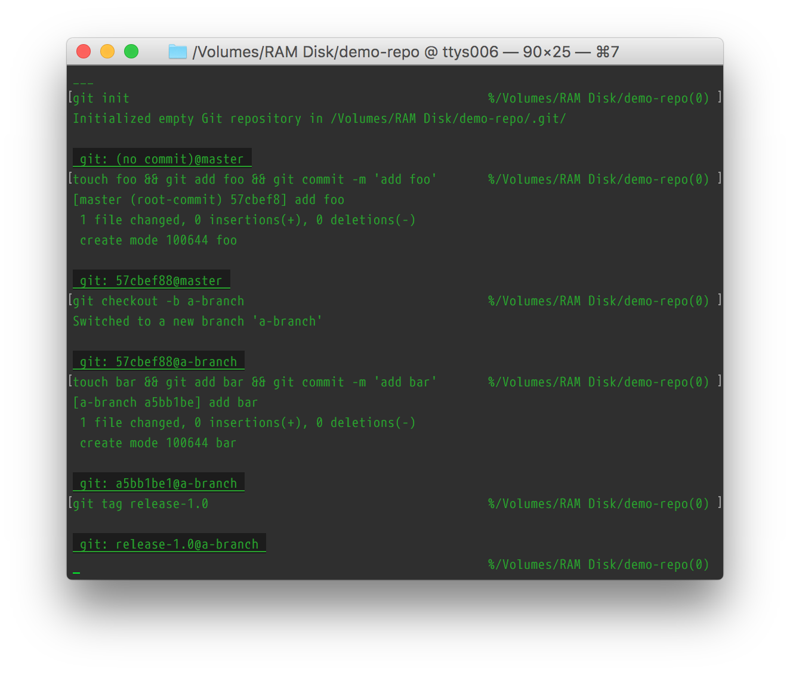
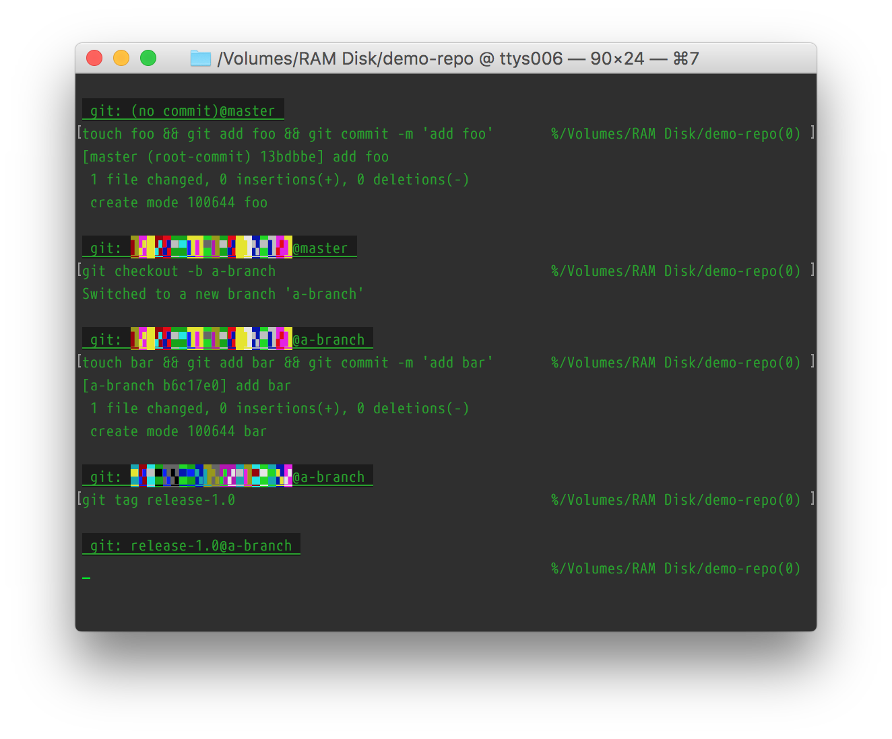

# Git-status prompt header for zsh

This is a shell function that outputs a one-line git status report, suitable for inclusion in (or above) your shell prompt:

If you have [hashvis](https://github.com/boredzo/hashvis) installed, then this function will automatically use it to format commit hashes:

## Setting it up

1. Copy the zpromptheaders.zsh file to your home directory as ~/.zpromptheaders .
2. In your .zshrc, source that file: `. ~/.zpromptheaders`
3. In your .zshrc, `setopt PROMPT_SUBST`. This enables running commands from the definitions of the prompt variables.
4. In your .zshrc, where you define `PS1`, include a call to `git_prompt_header`: `$(git_prompt_header || echo '___')` . You can leave out the `|| echo '___'` part if you want no header at all when you're not in a Git repo.
